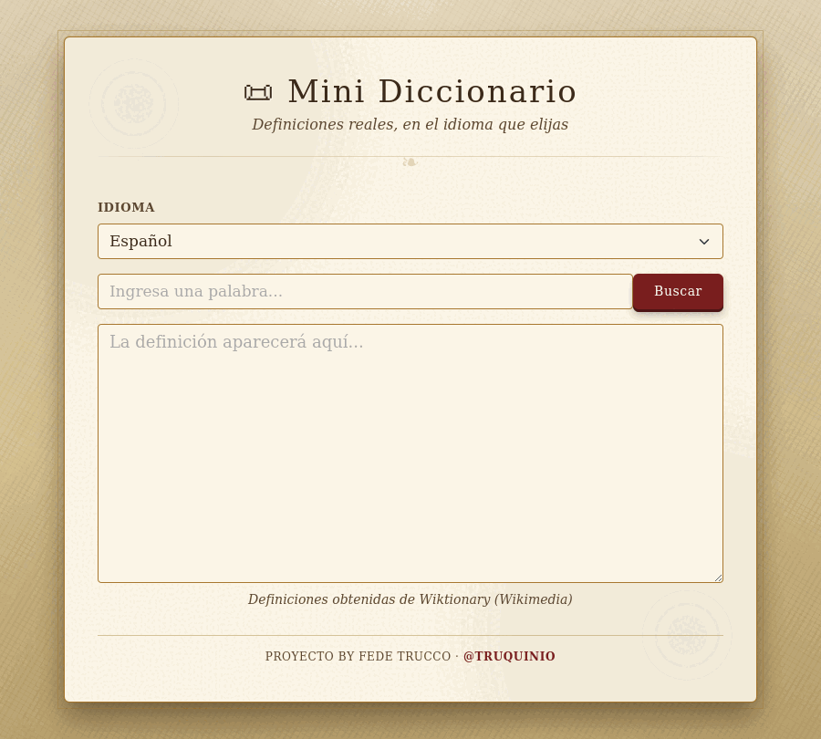
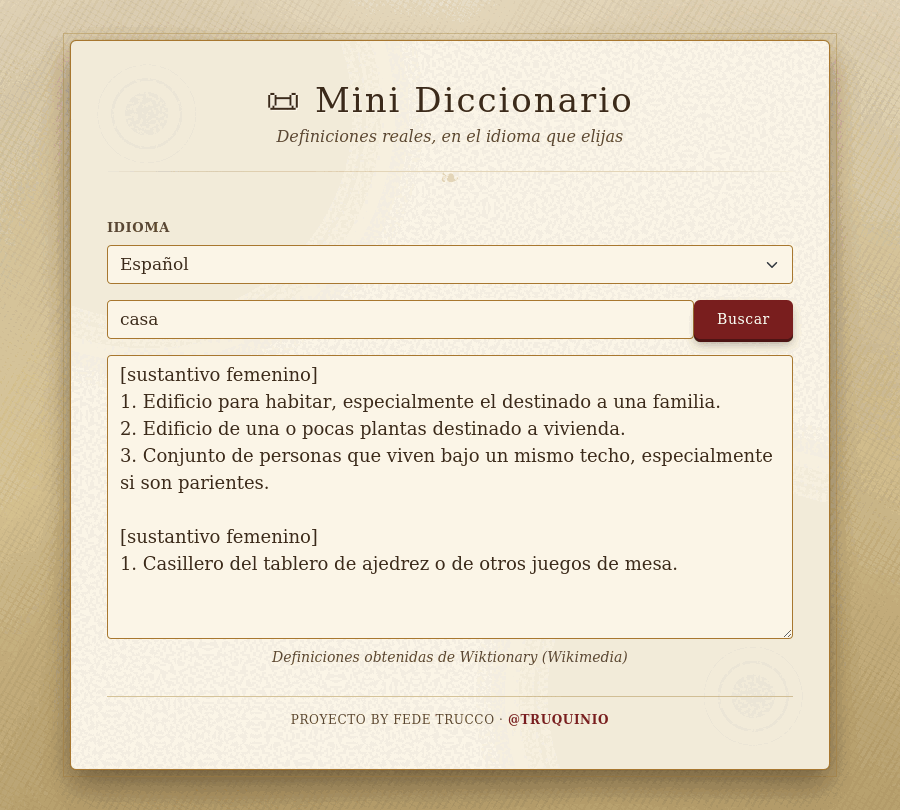

<div align="center">

# 📜 Mini Diccionario

*Un mini diccionario online multi-idioma, con look de manuscrito antiguo*

</div>

## ✨ ¿Qué es esto?

**Mini Diccionario** es una pequeña webapp que te permite escribir una palabra y obtener su **definición real**, consultada en vivo desde [Wiktionary](https://www.wiktionary.org/) (el proyecto hermano de Wikipedia dedicado a definiciones de palabras).

No usa una base de datos propia ni definiciones inventadas: cada búsqueda dispara una consulta HTTP al servidor de Wiktionary correspondiente al idioma elegido, y el backend en PHP se encarga de traducir esa respuesta a un texto legible.

Soporta 7 idiomas: **Español, Inglés, Catalán, Francés, Chino, Alemán y Ruso**.

## 📸 Capturas

| Estado inicial | Con una búsqueda hecha |
|---|---|
|  |  |

## 🧱 Estructura del proyecto

```
diccionario/
├── index.html          # Interfaz (Bootstrap 5 + tema de pergamino)
├── css/
│   └── style.css        # Estilos propios (tema medieval)
├── js/
│   └── funciones.js     # Lógica del front (jQuery + AJAX)
└── php/
    └── diccionario.php  # Backend: consulta la API de Wiktionary
```

## ⚙️ Cómo funciona

1. El usuario escribe una palabra y elige un idioma en `index.html`.
2. `js/funciones.js` envía esos datos por AJAX (`POST`) a `php/diccionario.php`.
3. `php/diccionario.php` llama a la API REST pública de Wiktionary:

   ```
   https://{idioma}.wiktionary.org/api/rest_v1/page/definition/{palabra}
   ```

4. El backend limpia el HTML de la respuesta, la ordena por categoría gramatical y la devuelve como JSON.
5. El front muestra el resultado en el textarea.

No hay base de datos, no hay API key, no hay configuración adicional: solo necesita que el servidor PHP tenga salida a internet.

## 🛠️ Requisitos

- PHP 7.4 o superior
- Extensión `curl` habilitada (viene activada por defecto en la mayoría de instalaciones)
- Acceso saliente a internet en el servidor (puerto 443)

## 🚀 Instalación / uso local

```bash
# Clonar el repositorio
git clone https://github.com/truquinio/clonWiki.git
cd clonWiki

# Levantar un servidor PHP de prueba
php -S localhost:8000
```

Luego abrí [http://localhost:8000](http://localhost:8000) en tu navegador.

> También funciona en cualquier hosting con PHP + Apache/Nginx (XAMPP, Laragon, etc.), simplemente copiando la carpeta al directorio público del servidor.

## 🌍 Idiomas soportados

| Código | Idioma |
|---|---|
| `es` | Español |
| `en` | Inglés |
| `ca` | Catalán |
| `fr` | Francés |
| `zh` | Chino |
| `de` | Alemán |
| `ru` | Ruso |

*(La cantidad de palabras disponibles depende de qué tan completa esté esa edición de Wiktionary; inglés y español suelen tener la mayor cobertura.)*

## 🎨 Stack

- **HTML5 + Bootstrap 5** para la maqueta
- **CSS propio** con tema de pergamino/manuscrito medieval (tipografías Cinzel + EB Garamond, texturas con gradientes, botón estilo sello de lacre)
- **jQuery** para las llamadas AJAX
- **PHP + cURL** para consumir la API de Wiktionary

## 🤝 Contribuir

Ideas, mejoras o corrección de bugs son bienvenidas. Abrí un issue o mandá un pull request.

---

<div align="center">

**Proyecto by Fede Trucco** · [@truquinio](https://github.com/truquinio)

</div>
