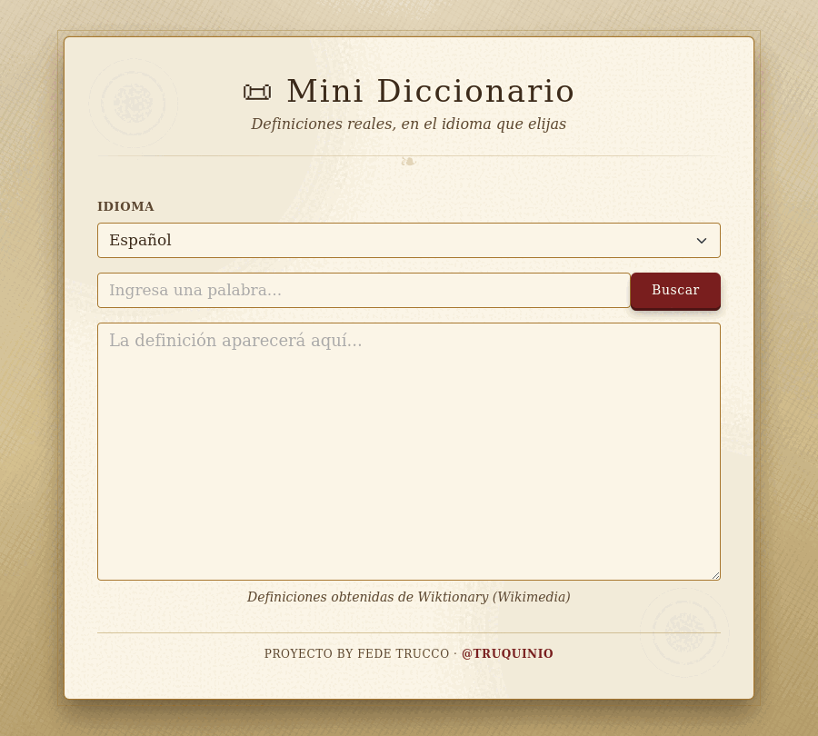
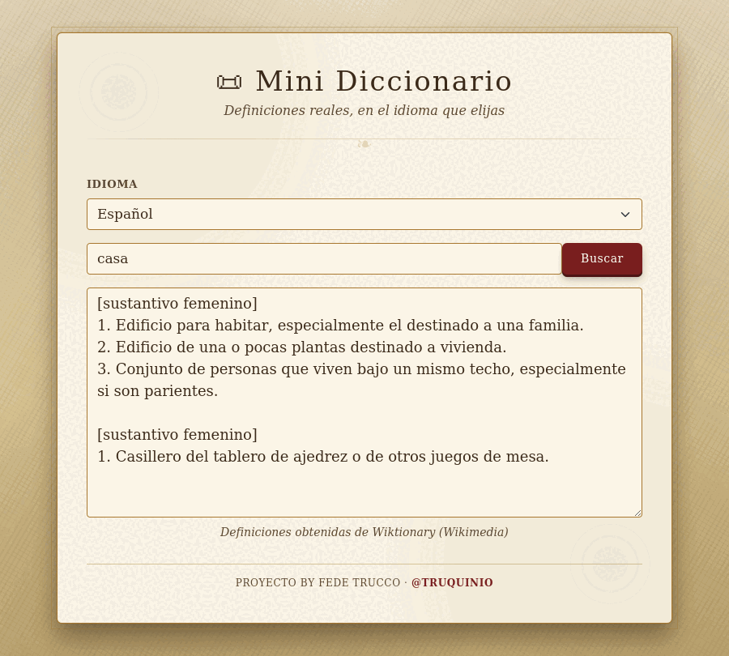

<div align="center">

# 📜 Mini Diccionario

**Webapp PHP multiidioma que consulta definiciones en Wiktionary y las presenta con una interfaz inspirada en manuscritos.**


</div>

---

## Qué hace

Mini Diccionario recibe una palabra y un idioma, consulta la API REST pública de Wiktionary desde PHP y devuelve las definiciones en texto legible.

No utiliza una base de datos propia ni requiere una API key.

Idiomas implementados:

**Español · Inglés · Catalán · Francés · Chino · Alemán · Ruso**

## 📸 Capturas

| Estado inicial | Resultado |
| --- | --- |
|  |  |

## 🔄 Flujo

```text
Usuario
  │
  ▼
index.html
  │ AJAX POST
  ▼
php/diccionario.php
  │ HTTPS
  ▼
Wiktionary REST API
  │ JSON
  ▼
limpieza HTML + agrupación
  │
  ▼
respuesta mostrada en la interfaz
```

El endpoint utilizado por el backend es:

```text
https://{idioma}.wiktionary.org/api/rest_v1/page/definition/{palabra}
```

## 🧱 Stack

| Área | Tecnología |
| --- | --- |
| UI | HTML5 · Bootstrap 5 · CSS |
| Interacción | jQuery · AJAX |
| Backend | PHP · cURL |
| Datos | Wiktionary REST API |

## 🗂️ Estructura

```text
.
├── index.html
├── css/
│   └── style.css
├── js/
│   └── funciones.js
├── php/
│   └── diccionario.php
└── screenshots/
```

## ▶️ Ejecutar localmente

### Requisitos

- PHP 7.4 o superior
- extensión `curl`
- salida HTTPS a internet

```bash
git clone https://github.com/truquinio/clonWiki.git
cd clonWiki
php -S localhost:8000
```

Abre `http://localhost:8000`.

También puede servirse desde Apache/Nginx o entornos locales como XAMPP siempre que PHP y cURL estén disponibles.

## ⚠️ Limitaciones

- La disponibilidad y cobertura dependen de cada edición de Wiktionary.
- El proyecto depende del endpoint REST externo utilizado por Wikimedia.
- No hay caché ni base de datos local.
- No hay una licencia de reutilización declarada en el repositorio actualmente.

---

**Federico Trucco / [@truquinio](https://github.com/truquinio)**
